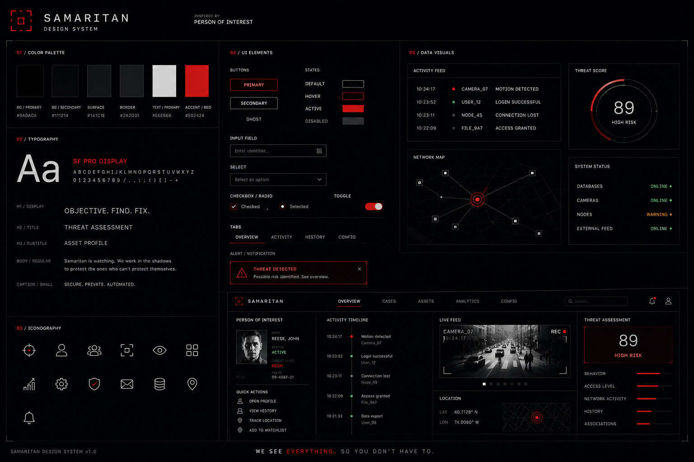

# ThemeForge BYOK

Generate complete design systems from a short description. Bring your own OpenAI API key.



## What it does

ThemeForge BYOK turns a visual theme idea into a production-ready design package:

1. **AI-generated showcase image** — A dense, poster-style design-system board with color palette, typography, UI controls, data visualizations, and a dashboard preview
2. **Structured theme JSON** — Machine-readable design tokens (colors, typography, spacing, radius, motion) plus component rules
3. **DESIGN.md** — Human-readable design rationale with YAML front matter, compatible with the [google-labs-code/design.md](https://github.com/google-labs-code/design.md) format
4. **Flutter Theme** — Ready-to-use `app_theme.dart` with light/dark/auto `ThemeData`, `ColorScheme`, `TextTheme`, and design token constants
5. **Bundle HTML Demo** — Self-contained `design-system-demo.html` with inline CSS, light/dark toggle, and live preview of the generated theme
6. **One-point iteration** — Select exactly one aspect (color, typography, mood, layout, etc.) and regenerate only what changed

## Live Demo

Deploy to Cloudflare Pages in minutes (see [Deployment](#deployment)).

## Tech Stack

- [Astro](https://astro.build) — Static site framework
- [React](https://react.dev) — Interactive UI islands
- [Tailwind CSS](https://tailwindcss.com) — Styling
- [Zustand](https://github.com/pmndrs/zustand) — Client state
- [Zod](https://zod.dev) — Schema validation
- [AI SDK 6.x](https://sdk.vercel.ai) + [OpenAI provider](https://sdk.vercel.ai/providers/ai-sdk-providers/openai) — AI orchestration
- [Cloudflare Pages](https://pages.cloudflare.com) — Hosting

## API Key Security

- Your OpenAI API key is entered client-side and **never sent to our servers**
- By default, the key is held only in memory
- Optional localStorage persistence (opt-in toggle)
- All AI calls go directly from your browser to OpenAI

## Getting Started

### Prerequisites

- Node.js 20+
- An OpenAI API key with access to the models you want to use

### Development

```bash
# Install dependencies
npm install

# Start dev server
npm run dev

# Build for production
npm run build
```

## Deployment

### Cloudflare Pages (recommended)

#### Option A: Wrangler CLI

```bash
npm run build
npx wrangler pages deploy dist
```

#### Option B: Git Integration

1. Push this repo to GitHub/GitLab
2. In Cloudflare Dashboard, create a new Pages project
3. Connect your Git repository
4. Build settings:
   - Build command: `npm run build`
   - Build output directory: `dist`

No environment variables are needed — this is a fully client-side BYOK app.

## Usage

1. **Describe your theme** — e.g. "Dark surveillance UI inspired by Samaritan from Person of Interest"
2. **Set product context** — e.g. "AI command cockpit / design system"
3. **Define the mood** — e.g. "cold, precise, dystopian, technical, premium"
4. **Paste your OpenAI API key**
5. **Generate** — Wait 2–5 minutes for the full package
6. **Iterate** — Use "Modify One Aspect" to tweak exactly one design dimension

## Output Formats

| File | Description |
|------|-------------|
| `theme.json` | Structured design tokens + component rules + image prompt |
| `DESIGN.md` | YAML front matter + markdown rationale + component guidance |
| `app_theme.dart` | Flutter `ThemeData` with light/dark/auto mode support, colors, typography, spacing, and radius |
| `design-system-demo.html` | Self-contained HTML demo with inline CSS (open in any browser) |
| `image.png` | Design-system showcase board (1536×1024 poster) |
| `prompt.txt` | The generated image prompt for reuse or refinement |
| `themeforge-export.zip` | Bundle of all files above |

## Model Configuration

The app defaults to:
- Text generation: `gpt-5.5`
- Image generation: `gpt-image-2`

If these models aren't available in your OpenAI account, edit `src/lib/ai.ts` to use alternatives like `gpt-4.5-turbo` or `dall-e-3`.

## Project Structure

```
src/
  components/       # React UI components
  layouts/          # Astro layouts
  lib/              # AI SDK integration, schema, prompts, templating
  pages/            # Astro pages
  stores/           # Zustand state management
  styles/           # Global CSS
  types/            # TypeScript types
public/             # Static assets
```

## Flutter Integration

Drop `app_theme.dart` into your Flutter project and use it directly:

```dart
import 'app_theme.dart';

MaterialApp(
  theme: AppTheme.lightThemeData,
  darkTheme: AppTheme.darkThemeData,
  themeMode: ThemeMode.system, // or ThemeMode.light / ThemeMode.dark
  home: MyHomePage(),
)
```

Or let the theme adapt automatically to system brightness:

```dart
MaterialApp(
  theme: AppTheme.of(context), // auto-detects platform brightness
  home: MyHomePage(),
)
```

Or reference individual design tokens:

```dart
Container(
  color: AppTheme.lightThemeData.colorScheme.surface,
  padding: EdgeInsets.all(AppThemeLight.spacingMd),
  child: Text('Hello', style: TextStyle(color: AppThemeLight.accent)),
)
```

## License

[MIT](./LICENSE)

## Changelog

See [CHANGELOG.md](./CHANGELOG.md)
